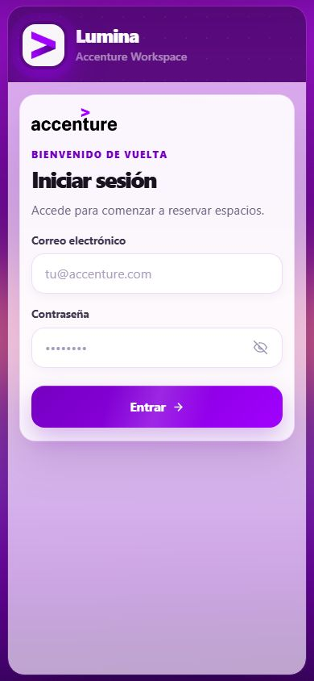
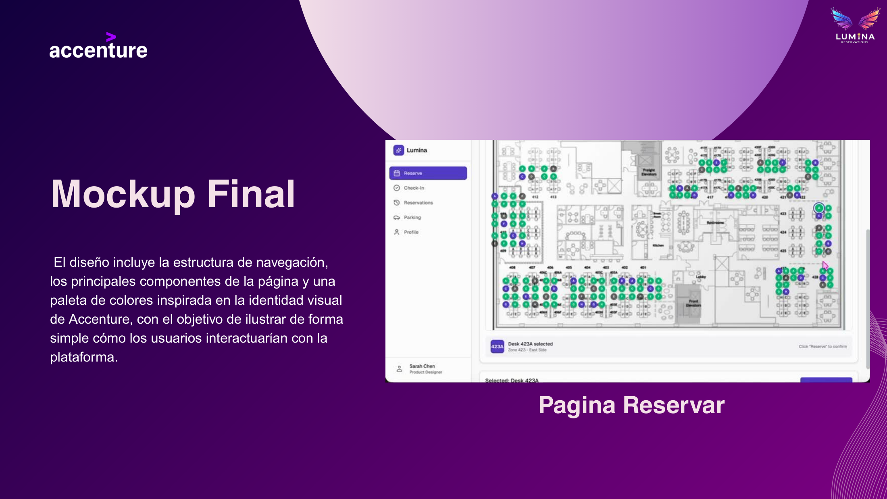

# WorkHub MTY (Lumina)

Sistema de reservas de escritorios, salas y estacionamiento para oficinas, con mapa de cada piso y ocupación en tiempo real. Lo usarían empleados, administradores y personal de guardia de un edificio de oficinas.

**Sitio en vivo:** https://work-hub-mty-six.vercel.app/login (pide cuenta, así que solo se ve la pantalla de acceso)






## Qué hace

- Reserva de escritorios y salas por fecha, horario, piso y categoría.
- Estacionamiento ligado a una reserva de espacio, con al menos 24 horas de anticipación.
- Mapa interactivo por piso que muestra disponibilidad y quién ocupa cada lugar.
- Ocupación en tiempo real con Server-Sent Events, sin recargar la página.
- Check-in con ventana de tiempo y red permitida.
- Recomendaciones y chatbot con IA (Gemini u OpenAI) que usan el historial de ocupación.
- Roles con vistas distintas: empleado, administrador (KPIs y bloqueos de espacios) y guardia (estacionamientos del día).

## Mi parte

Proyecto académico en equipo del Tecnológico de Monterrey (2026), trabajado en sprints semanales. Yo hice:

- El backend de reservas en Node, Express y TypeScript: servicios, repositorios, controladores y migraciones.
- El monitoreo de ocupación en tiempo real con SSE.
- El mapa de piso y el flujo de reserva en React, con acceso por rol.

## Tecnologías

- Backend: Node.js 20, Express, TypeScript, PostgreSQL en Supabase, JWT y Vitest
- Frontend: React 18, Vite, TypeScript, CSS Modules y Testing Library
- IA: Gemini u OpenAI, con modelos de respaldo
- Frontend desplegado en Vercel

## Cómo correrlo en local

Necesitas Node.js 20 o superior y una base PostgreSQL.

```bash
cd luminaBack-main
npm install
npm run dev
```

En otra terminal:

```bash
cd luminaFront-main
npm install
npm run dev
```

La API corre en http://localhost:3000 y el frontend en http://localhost:5173.

Variables del backend en `luminaBack-main/.env` (hay un ejemplo en `.env.example`):

- `DATABASE_URL`, `JWT_SECRET`, `JWT_ALGORITHM` y `JWT_EXPIRES_IN`
- `PORT`, `NODE_ENV` y `ALLOWED_ORIGINS`
- `AI_PROVIDER`, `GEMINI_API_KEY` y `OPENAI_API_KEY` (opcionales, para la IA)

El frontend solo necesita `VITE_API_URL` si la API no está en el puerto 3000. Las pruebas se corren con `npm test` en cada carpeta.

## Estructura

```
luminaBack-main/   API REST, migraciones y pruebas
luminaFront-main/  aplicación web en React
docs/              documentación técnica y presentación del proyecto
```

La descripción completa de la API, las migraciones y las reglas de negocio está en [`docs/documentacion-tecnica.md`](docs/documentacion-tecnica.md). La presentación está en [`docs/presentation/`](docs/presentation/).

Autor de este repositorio: [Hermann Pauwells Rivera](https://hermannpr.github.io/)

## Licencia

[MIT](LICENSE)
